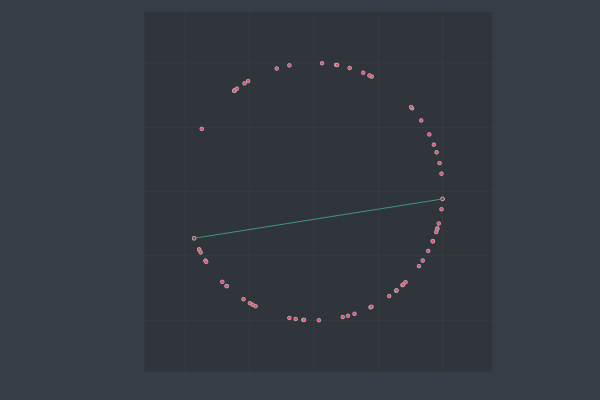

# Example

## Art gallery

In `art_gallery.jl`, the problem of cameras in an art gallery is solved. The big
colored (red, green or blue) markers at the end of the gifs are the positions
of the cameras inside the polygon.

First, a radially ordered polygon is created for test. It is partitioned in
$y$-monotone polygons, which are then triangulated.

Two examples of this can be found in `triangulation40.gif` and
`triangulation100.gif`. A third examples is shown in
`triangulationvoronoi.gif`, where a voronoi planar subdivision is taken and
triangulated (the cells are monotone in every direction).

### Make monotone and triangulation

### Triangulation

## Convex hull

Three algorithms covered in the book were implemented, with several examples
each. These were obtained with code similar to what is inside of `convexhull.jl`.

### Jarvis March

### Graham scan

### Quick hull

## Voronoi

The incremental voronoi algorithm is implemented, which is quadratic in
complexity, but easier to program. Several examples to show it in the workings,
all implemented in `voronoi.jl`.

